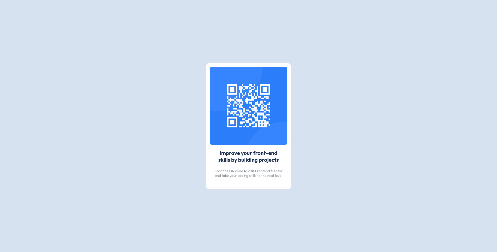

# Frontend Mentor - QR code component solution

This is a solution to the [QR code component challenge on Frontend Mentor](https://www.frontendmentor.io/challenges/qr-code-component-iux_sIO_H). 

## Table of contents

- [Overview](#overview)
  - [Screenshot](#screenshot)
  - [Links](#links)
- [My process](#my-process)
  - [Built with](#built-with)
  - [What I learned](#what-i-learned)
  - [Continued development](#continued-development)
  - [Useful resources](#useful-resources)
- [Author](#author)

## Overview

### Screenshot

### Links

- [Github Repo](https://github.com/savente93/FM-QR-component)
- [Live version](https://savente93.github.io/FM-QR-component/)

## My process

### Built with

- Plain HTML
- CSS

### What I learned

- **centering**: at least _a_ solution for how to center something in the page. I feel like there has to be an easier way to do this, but this is okay for now. 
- **variables**: Got some more practice with CSS variables, which I like. Makes it easy to make sure you're following the design specs.

### Continued development

Layout is still pretty hard for me. I don't have a really good eye for spacing yet, and I find it hard to predict where thing will end up in the page when I make a change. I want to improve my intuition for this so I can make layouts a bit faster. 

### Useful resources

- [CSS centering](https://www.w3schools.com/csS/css_align.asp) - Centering stuff in CSS is hard, used this solution. Part of me feels like there has to be something easier, but this is ok for now.
- [Viewport units](https://youtu.be/veEqYQlfNx8) - A very helpful video about viewport units and how to make sure the page can take up the entire view. Didn't end up using it in the final solution but tried it out during the making and this helped my understanding.

## Author

- Website - [Sam Vente](https://sam-vente.com)
- Blog - [howtoai.fyi](https://howtoai.fyi)
- Frontend Mentor - [@yourusername](https://www.frontendmentor.io/profile/savente93)
